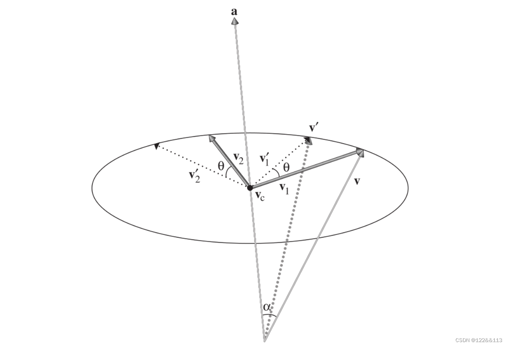
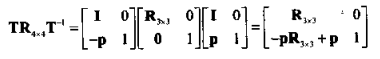
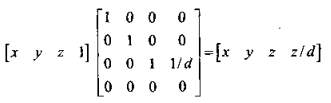
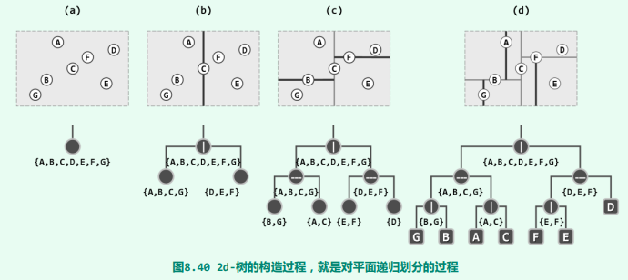
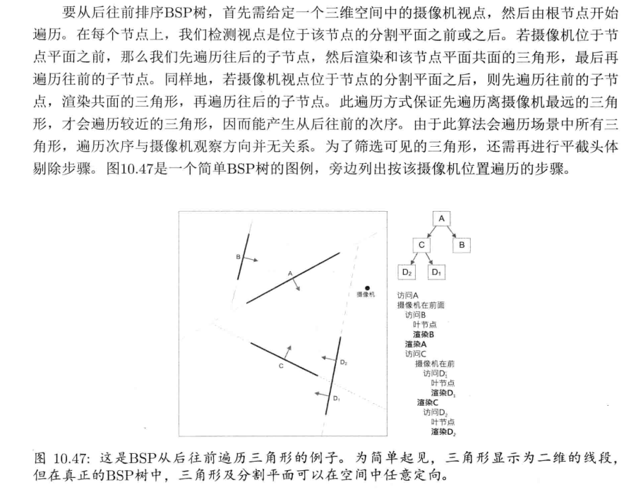

# Math

## 向量

### 点乘：`|a|*|b|*cos`

点乘的符号用来判断两向量的夹角，大于0则方向基本相同，等于0为垂直，小0为相反。  
a在b上的投影`a' = b * (|a|*|b|*cos)/(|b|^2)`，若b为单位向量，则可以直接取点乘结果。

### 叉乘：`|a|*|b|*sin`

方向为a到b，大小为平行四边形的面积。

## 矩阵(方阵)

矩阵能表示线性变换，一般来说**对物体的变换**取相反的量即可表示**对坐标系的变换**。  
构造变换物体的矩阵时，其三个行向量既对应三个单位坐标轴经过变化后的坐标（想象其在变换一个单位立方体）。

## 变换

### 绕坐标轴旋转

三角函数

### 绕任意轴旋转

UE函数`FVector::RotateAngleAxis`

公式推导：

1. 将V分解为垂直旋转轴的分量V1和平行旋转轴的分量Vc。只旋转垂直分量，得到的结果加上平行分量就是最终结果。V' = V1' + Vc
2. 平行分量既投影，点积可得，Vc = (V dot A)A。垂直分量则为 V1 = V - Vc。
3. V1'是V1旋转角度D所得，其也可以分解为垂直和平行V1的分量相加得到，既 V1' = V1 cosD + V2 sinD
4. 而V2是同时垂直于V1和旋转轴A的向量，长度与V1相等，可得 V2 = A cross V1

### 绕任意轴缩放

同样把v分解垂直和水平分量，然后只需缩放水平分量，加上垂直分量即可。

### 正交变换

平移，旋转，镜像是仅有的正交变换。其原始的长度，角度，面积均不会变化。旋转和镜像对应的矩阵是正交矩阵，可以方便的求逆矩阵。

## 行列式

3x3矩阵的行列式等于(a x b) * c。其几何意义为有，变换后的基向量组成的平行六面体的带符号体积。  
矩阵的逆可通过行列式与伴随矩阵求得。  
正交矩阵的每一行都是单位向量，所有行之间互相垂直。  
正交矩阵的逆矩阵就是其转置矩阵。  

## 4D矩阵

### 平移

利用第四行进行平移，4D向量的w=1/0可以开启关闭平移。  
相应的也可以表示包含平移的变换，比如绕不通过原点的轴旋转/缩放等，其思路为将变换中心先平移到原点，执行变化后平移回原位置。

### 投影

将3D点(x,y,z)投影到距投影点为d的平面上，其坐标为(dx/z,dy/z,d)，按照4D齐次向量变换到3D向量时除以w的规则，可以得到对应的4D齐次坐标为(x,y,z,z/d)。故存在矩阵将(x,y,z,1)变换为(x,y,z,z/d)，这样的4x4矩阵就是投影矩阵。

## 几何检测

### 某点在给定图元上的最近点（也可视为计算距离）

- 在射线上的最近点：等于求投影点。若知道射线方向，则点乘即可。
- 在平面上的最近点：先求得点到平面的距离：点乘平面的法向量，减去原点到平面的距离。或者以平面上一点到所求点的向量进行点乘。之后沿着n方向平移-d即可。
- 球上的最近点：球心到点的向量，长度为半径
- AABB上的最近点：对每个坐标clamp到min到max之间

### 相交测试

- 射线与平面：射线方向与平面法线点乘。若为0，则射线与平面平行，无交叉点。若不为0，则射线原点到平面的距离比上射线在n方向上的长度（均为点乘得到），等于相交点到原点的距离比上射线总长度，即为t，可以此求得相交点。(`FMath::LinePlaneIntersection`)
- AABB与平面：计算顶点与n的点积，与d比较，可以判断该点在平面的那一面。若所有点都在一侧，则不相交。可以不必计算全部8个点，而是将n分解为三个坐标轴来获得进行计算的两个点。若nx为正方向，则说明点积最小的顶点为Xmin，点积最大的顶点为Xmax。nx为负方向则相反。对三个轴分别得到点积最大和最小的点，计算这两个点即可。(`FMath::PlaneAABBRelativePosition`)
- 射线与球：于交叉平面上利用勾股定理求得。(`FMath::LineSphereIntersection`)
- 球与球：球心距离比半径和。
- 球与AABB:球心在AABB上的最近点，比较该距离与半径。(`FMath::SphereAABBIntersection`)
- 球与平面：球心到平面的距离与半径比较。
- 射线与AABB：先判断与哪个面相交，再检测射线与平面的相交性。具体为投影到三个平面，每个平面求得相交的t，取t最大对应的平面。(`FMath::LineExtentBoxIntersection`)
- 两个AABB：坐标轴为分离轴。对三个坐标，比较两者的min,max是否重叠，若都重叠，则相交。(`FBox::Intersect`)

其他

- Pick:`UGameplayStatics::DeprojectScreenToWorld`
- 点在平面上的投影是否在三角形内：投影点与三角形的顶点组成的向量按顺序叉乘(PAxPB,PBxPC,PCxPA)，若所有结果的方向一致，则在三角形内

## 可见性检测

### 空间划分的方式

四叉树，八叉树，BSP，kd树

kd树例子:

BSP排序

### Culling

frustum culling：判断bounding volume是否在某一平面外侧，若是，则排除渲染。将平面向外侧移动半径的距离，然后判断球心在哪一侧即可

[UE Document](https://docs.unrealengine.com/latest/en-US/visibility-and-occlusion-culling-in-unreal-engine/)

UE常见的几种为:

- Distance
- View Frustum(判断bounding sphere与平面的距离)
- Precomputed Visibility
- Dynamic Occlusion
  - Hardware Occlusion Queries(使用GPU做检查，故结果会延迟一帧)
  - Hierarchical Z-Buffer Occlusion
  - Software Occlusion Queries(CPU侧计算，用于不支持Hardware Occlusion Queries的移动设备)
