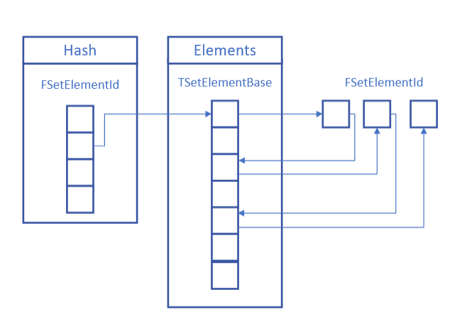

# Containers

## TArray

TArray对应std::vector，其为动态的连续数组，会按需要重新分配内存。其随机访问速度快，但是添加删除操作慢，并且指向其元素的指针会在重新分配内存后失效。

### 常用接口

- 添加：Add/Emplace/EmplaceAt/AddDefaulted/Insert/AddUnique/Append（用于将另一个数组添加到当前TArray的末尾）
- 删除：Pop/RemoveAt/Remove/RemoveSingle/RemoveAll（均有Swap版）
- 查找：Find/FindLast/FindByKey/IndexOfByKey(需要ElementType重载了对KeyType的operator==)/FilterByPredicate/Contains

### Tips

扩容逻辑(`DefaultCalculateSlackGrow`)：默认情况下，第一次会分配4个元素，之后每次扩容会增加16个加上元素数量的一定比例以及内存对齐。

在创建时，如果预先知道有多少元素，可以调用`Reserve`来避免多次扩容。

`RemoveAt`等函数有参数`bAllowShrinking`默认为true，其决定在删除后是否调用`ResizeShrink`，可根据需要设置。

如果不在意顺序，可以使用RemoveAtSwap来代替RemoveAt，这样会减少Memcpy的数量

清除数组：Reset如果大小小于ArrayMax，则不会重新申请内存，而Empty要相等才不会重新申请。

遍历:

```C++
for (ShapeArrayType::TIterator Iter(MyShapeArray); Iter; ++Iter)
for (auto Iter = MyShapeArray.CreateIterator(); Iter; ++Iter)
for (auto* MyShape : MyShapeArray) // 使用auto时记得使用指针或引用
```

排序:  
Sort使用introspective sort(quick sort+heap sort)，StableSort使用MergeSort

RemoveAll优化:  
在寻找匹配的元素时，用分段的形式，而不是一个个删除。删除一段匹配的元素时调用析构函数，之后并不马上移动后面的元素，而是直到找到下一个匹配的元素，这样得到了一段不匹配的元素，只移动这一段元素。这样避免了靠后的元素多次移动。  
例如:(1,2,3,3,3,4,5,3,3,3,6)移除3的流程为：(1,2,x,x,x,4,5,3,3,3,6)->(1,2,4,5,x,x,x,3,3,3,6)->(1,2,4,5,x,x,x,x,x,x,6)->(1,2,4,5,6,x,x,x,x,x,x)

## TMap/TSet/TSparseArray

`TMap`使用哈希表存储数据，其查询速度非常快。`TMap`使用`TSet`实现，而`TSet`使用`TSparseArray`实现。

### TSparseArray

`TSparseArray`是一个不连续的数组。其底层还是TArray，但是在删除时不会移动元素，其开销只有O(1)。其包含四个成员：

```C++
	typedef TArray<FElementOrFreeListLink,typename Allocator::ElementAllocator> DataType;
	DataType Data;

	typedef TBitArray<typename Allocator::BitArrayAllocator> AllocationBitArrayType;
	AllocationBitArrayType AllocationFlags;

	/** The index of an unallocated element in the array that currently contains the head of the linked list of free elements. */
	int32 FirstFreeIndex;

	/** The number of elements in the free list. */
	int32 NumFreeIndices;
```

`Data`是一个TArray，存储真正的数据，`AllocationFlags`为TBitArray，存储某个Index是否有数据。`NumFreeIndices`则表示有多少可用的Index（元素被删除后，其Index会被视为可用，并在下次添加元素时使用），`FirstFreeIndex`则用于查找这些Index。

`Data`存储的实际类型如下：

```C++
/** Allocated elements are overlapped with free element info in the element list. */
template<typename ElementType>
union TSparseArrayElementOrFreeListLink
{
	/** If the element is allocated, its value is stored here. */
	ElementType ElementData;

	struct
	{
		/** If the element isn't allocated, this is a link to the previous element in the array's free list. */
		int32 PrevFreeIndex;

		/** If the element isn't allocated, this is a link to the next element in the array's free list. */
		int32 NextFreeIndex;
	};
};
```

当其有数据时，存储的是真正的数据ElementType，当其被删除后，则以链表的形式存储前后可用的Index。

#### 删除元素

```C++
	/** Removes Count elements from the array, starting from Index. */
	void RemoveAt(int32 Index,int32 Count = 1)
	{
		if (!TIsTriviallyDestructible<ElementType>::Value)
		{
			FElementOrFreeListLink* DataPtr = (FElementOrFreeListLink*)Data.GetData();
			for (int32 It = Index, ItCount = Count; ItCount; ++It, --ItCount)
			{
				((ElementType&)DataPtr[It].ElementData).~ElementType();
			}
		}

		RemoveAtUninitialized(Index, Count);
	}

	/** Removes Count elements from the array, starting from Index, without destructing them. */
	void RemoveAtUninitialized(int32 Index,int32 Count = 1)
	{
		FElementOrFreeListLink* DataPtr = (FElementOrFreeListLink*)Data.GetData();

		for (; Count; --Count)
		{
			check(AllocationFlags[Index]);

			// Mark the element as free and add it to the free element list.
			if(NumFreeIndices)
			{
				DataPtr[FirstFreeIndex].PrevFreeIndex = Index;
			}
			DataPtr[Index].PrevFreeIndex = -1;
			DataPtr[Index].NextFreeIndex = NumFreeIndices > 0 ? FirstFreeIndex : INDEX_NONE;
			FirstFreeIndex = Index;
			++NumFreeIndices;
			AllocationFlags[Index] = false;

			++Index;
		}
	}
```

这里首先调用了析构函数。之后并不会像TArray一样移动后面的元素，而是将被删除的Index加入到链表头，既当前`FirstFreeIndex`之前，然后更新`FirstFreeIndex`/`NumFreeIndices`和`AllocationFlags`。

#### 添加元素

```C++
	/** Adds an element to the array. */
	int32 Add(const ElementType& Element)
	{
		FSparseArrayAllocationInfo Allocation = AddUninitialized();
		new(Allocation) ElementType(Element);
		return Allocation.Index;
	}

	/**
	 * Allocates space for an element in the array.  The element is not initialized, and you must use the corresponding placement new operator
	 * to construct the element in the allocated memory.
	 */
	FSparseArrayAllocationInfo AddUninitialized()
	{
		int32 Index;
		if(NumFreeIndices)
		{
			FElementOrFreeListLink* DataPtr = (FElementOrFreeListLink*)Data.GetData();

			// Remove and use the first index from the list of free elements.
			Index = FirstFreeIndex;
			FirstFreeIndex = DataPtr[FirstFreeIndex].NextFreeIndex;
			--NumFreeIndices;
			if(NumFreeIndices)
			{
				DataPtr[FirstFreeIndex].PrevFreeIndex = -1;
			}
		}
		else
		{
			// Add a new element.
			Index = Data.AddUninitialized(1);
			AllocationFlags.Add(false);
		}

		return AllocateIndex(Index);
	}

	/** Marks an index as allocated, and returns information about the allocation. */
	FSparseArrayAllocationInfo AllocateIndex(int32 Index)
	{
		check(Index >= 0);
		check(Index < GetMaxIndex());
		check(!AllocationFlags[Index]);

		// Flag the element as allocated.
		AllocationFlags[Index] = true;

		// Set the allocation info.
		FSparseArrayAllocationInfo Result;
		Result.Index = Index;
		Result.Pointer = &((FElementOrFreeListLink*)Data.GetData())[Result.Index].ElementData;

		return Result;
	}
```

添加元素则是首先检查`NumFreeIndices`从可用链表里拿一个直接使用，若没有，则调用TArray的添加操作。

### TSet

`TSet`则是使用`TSparseArray`实现的，其使用哈希表将Key映射到Index上。其成员如下：

```C++
	using ElementArrayType = TSparseArray<SetElementType, typename Allocator::SparseArrayAllocator>;
	using HashType         = typename Allocator::HashAllocator::template ForElementType<FSetElementId>;

	ElementArrayType Elements;

	mutable HashType Hash;
	mutable int32	 HashSize;
```

`Elements`就是存储了`TSetElement`的TSparseArray。

```C++
template<typename InElementType, bool bTypeLayout>
class TSetElementBase
{
public:
	// ......

	/** The element's value. */
	ElementType Value;

	/** The id of the next element in the same hash bucket. */
	mutable FSetElementId HashNextId;

	/** The hash bucket that the element is currently linked to. */
	mutable int32 HashIndex;
};
```

`TSetElement`除了包含真正的数据，还存有自己的`HashIndex`以及用于冲突时的`HashNextId`。

`Hash`则是储存`FSetElementId`的数组。其成员`FSetElementId::Index`就是Elements的Index。

```C++
	/** The index of the element in the set's element array. */
	int32 Index = INDEX_NONE;
```

#### 添加元素

```C++
	/**
	 * Adds an element to the set.
	 *
	 * @param	Args						The argument(s) to be forwarded to the set element's constructor.
	 * @param	bIsAlreadyInSetPtr	[out]	Optional pointer to bool that will be set depending on whether element is already in set
	 * @return	A handle to the element stored in the set.
	 */
	template <typename ArgsType = ElementType>
	FSetElementId Emplace(ArgsType&& Args, bool* bIsAlreadyInSetPtr = nullptr)
	{
		// Create a new element.
		FSparseArrayAllocationInfo ElementAllocation = Elements.AddUninitialized();
		SetElementType& Element = *new (ElementAllocation) SetElementType(Forward<ArgsType>(Args));

		SizeType NewHashIndex = ElementAllocation.Index;

		uint32 KeyHash = KeyFuncs::GetKeyHash(KeyFuncs::GetSetKey(Element.Value));
		if (!TryReplaceExisting(KeyHash, Element, NewHashIndex, bIsAlreadyInSetPtr))
		{
			RehashOrLink(KeyHash, Element, NewHashIndex);
		}
		return FSetElementId(NewHashIndex);
```

先在Elements里添加元素，然后将实际的值转为Key（`GetSetKey`），再算出对应的uint32的Hash（`GetKeyHash`），统一使用该类型做之后的计算。这里使用`BaseKeyFuncs`来封装了一些操作，默认的`DefaultKeyFuncs`里，`GetSetKey`直接返回本身，`GetKeyHash`则是直接调用`GetTypeHash`来计算。

`TryReplaceExisting`里会检测重复的元素。bAllowDuplicateKeys默认为false，若找到重复的元素，则会删除原本的元素。

之后会调用`RehashOrLink`。这里会通过`Allocator::GetNumberOfHashBuckets`得到的大小来检查是否扩容（或缩容）。最终通过`LinkElement`进行Hash操作。这里直接使用`KeyHash & (HashSize - 1)`取模（由于`HashSize`来自于`GetNumberOfHashBuckets`，其一定是2的N次幂，故可以使用位与来快速取模），得到用于`Hash`的Index。这里的`GetTypedHash`就相当于访问数组在对应Index的元素。接着将`Hash`当前Index的内容赋给HashNextId，并更新`Hash`当前Index为新添加的元素。这里相当于每个`Hash`存储一个单向链表，每次Link时添加到链表的头部。

```C++
	/** Links an added element to the hash chain. */
	FORCEINLINE void LinkElement(SizeType ElementIndex, const SetElementType& Element, uint32 KeyHash) const
	{
		// Compute the hash bucket the element goes in.
		Element.HashIndex = KeyHash & (HashSize - 1);

		// Link the element into the hash bucket.
		Element.HashNextId.Index = GetTypedHash(Element.HashIndex).Index;
		GetTypedHash(Element.HashIndex).Index = ElementIndex;
	}
```

#### 删除元素

```C++
	template<typename ComparableKey>
	FORCEINLINE int32 RemoveImpl(uint32 KeyHash, const ComparableKey& Key)
	{
		int32 NumRemovedElements = 0;

		FSetElementId* NextElementId = &GetTypedHash(KeyHash);
		while (NextElementId->IsValidId())
		{
			SetElementType& Element = Elements[NextElementId->Index];

			if (KeyFuncs::Matches(KeyFuncs::GetSetKey(Element.Value), Key))
			{
				// This element matches the key, remove it from the set.  Note that Remove sets *NextElementId to point to the next
				// element after the removed element in the hash bucket.
				RemoveByIndex(NextElementId->Index);
				NumRemovedElements++;

				if (!KeyFuncs::bAllowDuplicateKeys)
				{
					// If the hash disallows duplicate keys, we're done removing after the first matched key.
					break;
				}
			}
			else
			{
				NextElementId = &Element.HashNextId;
			}
		}

		return NumRemovedElements;
	}
```

这里会根据key算出Hash从`Hash`里拿到相应的`FSetElementId`进而得到Element，然后调用`KeyFuncs::Matches`判断Key是否相同，若否就接着`HashNextId`继续找。若找到，就会调用`RemoveByIndex`进行删除。

```C++
	void RemoveByIndex(SizeType ElementIndex)
	{
		checkf(Elements.IsValidIndex(ElementIndex), TEXT("Invalid ElementIndex passed to TSet::RemoveByIndex"));

		const SetElementType& ElementBeingRemoved = Elements[ElementIndex];

		// Remove the element from the hash.
		FSetElementId* HashPtr              = Hash.GetAllocation();
		SizeType*      NextElementIndexIter = &HashPtr[ElementBeingRemoved.HashIndex].Index;
		for (;;)
		{
			SizeType NextElementIndex = *NextElementIndexIter;
			checkf(NextElementIndex != INDEX_NONE, TEXT("Corrupt hash"));

			if (NextElementIndex == ElementIndex)
			{
				*NextElementIndexIter = ElementBeingRemoved.HashNextId.Index;
				break;
			}

			NextElementIndexIter = &Elements[NextElementIndex].HashNextId.Index;
		}

		// Remove the element from the elements array.
		Elements.RemoveAt(ElementIndex);
	}
```

这里的直接拿到需要删除的元素，通过其`HashIndex`获得存在`Hash`里的首元素，然后遍历找到该值，从链表中删掉。最后再执行`TSparseArray::RemoveAt`来实际删除元素。

TSet的整体结构如下图:



### TMap

`TMap`的继承结构为`TMap` - `TSortableMapBase` - `TMapBase`。`TMapBase`包含成员`Pairs`。

```C++
	using TPair = TTuple<KeyType, ValueType>;
	typedef TPair<KeyType, ValueType> ElementType;
	typedef TSet<ElementType, KeyFuncs, SetAllocator> ElementSetType;

	/** A set of the key-value pairs in the map. */
	ElementSetType Pairs;
```

`Pairs`就是以`TPair`为元素类型的`TSet`，而`TPair`类似`std::pair`，其使用`TTuple`实现。

`TMap`默认使用了`TDefaultMapKeyFuncs`作为默认`KeyFuncs`，其区别于`TSet`的点是`GetSetKey`使用`Element.Key`作为返回，故所有相关的操作只看TPair.Key。

```C++
/** Defines how the map's pairs are hashed. */
template<typename KeyType, typename ValueType, bool bInAllowDuplicateKeys>
struct TDefaultMapKeyFuncs : BaseKeyFuncs<TPair<KeyType, ValueType>, KeyType, bInAllowDuplicateKeys>
{
	// .......

	static FORCEINLINE KeyInitType GetSetKey(ElementInitType Element)
	{
		return Element.Key;
	}
}
```

添加删除排序等操作则是直接使用`TSet`的方法。此外还有`TMultiMap`，其默认KeyFuncs的`bInAllowDuplicateKeys`为true，使TSet在只检查Key时能存储“相同”的元素。

#### 排序

与`std::unordered_set/std:unordered_map`不同，`TMap/TSet`是支持排序的。具体实现为对其内部的`TSparseArray`排序，然后调用`Rehash`。`TMap`也支持按`Key`或`Value`排序。

## FString/FText/FName

与`std::string`类似，`FString`存储的是`TArray`，其提供了多种查找/修改/比较功能，许多类也实现了`ToString`函数来讲信息转换为易读的字符串。

```C++
	/** Array holding the character data */
	typedef TArray<TCHAR, AllocatorType> DataType;
	DataType Data;
```

`FText`则存储的是`TSharedRef`，其内容无法直接修改，但是比较操作会很快。其用于向用户显示的文本，支持本地化和设置文本格式等功能。`ITextData`的不同派生类便提供了这些支持。

```C++
	/** The internal shared data for this FText */
	TSharedRef<ITextData, ESPMode::ThreadSafe> TextData;
```

`FName`本身只存储了Index，真正的字符串存储在全局的`FNamePool`中，其是不可被修改的。其用于存储特定的字符串，例如uasset的名称。由于只使用了Index，其查找和访问速度很快。同时该子系统也使用哈希表作为字符串到FName的快速转换手段。

```C++
	/** Index into the Names array (used to find String portion of the string/number pair used for comparison) */
	FNameEntryId	ComparisonIndex;
#if !UE_FNAME_OUTLINE_NUMBER
	/** Number portion of the string/number pair (stored internally as 1 more than actual, so zero'd memory will be the default, no-instance case) */
	uint32			Number;
#endif// ! //UE_FNAME_OUTLINE_NUMBER
#if WITH_CASE_PRESERVING_NAME
	/** Index into the Names array (used to find String portion of the string/number pair used for display) */
	FNameEntryId	DisplayIndex;
#endif // WITH_CASE_PRESERVING_NAME
```

## 其他

以上是最常用的几个容器，也都能加UPROPERTY在蓝图里使用（其他模板参数需保持默认）。还有其他几种较常用的容器如下：

- TTuple：存储一组数据，构建后不可改变其长度，元素类型可不一样。
- TList：单向链表，操作和底层实现类同stl。
- TDoubleLinkedList：双向链表，操作和底层实现类同stl。
- TSortedMap：键值映射表，始终有序（不能手动排序），底层用按Key排好序的TArray实现，并且保存了一组键值配对数组。占用的内存比TMap少一半，但增删元素复杂度是O(n)，查找复杂度是O(Log n)。
- FHashTable：常用于索引其它数组。根据其它Hash函数获取指定ID的Hash值，然后存储、查找其它数组的元素。
- TQueue：无边界非侵入式队列，使用无锁(lock-free)链表实现。支持多生产者-单消费者(MPSC)和单生产者-单消费者(SPSC)两种模式，两种模式下都是线程安全的。常用于多线程之间的数据传输和访问。
- TCircularQueue：无锁循环队列，先进先出，使用循环数组（TCircularBuffer）实现，在单生产者-单消费者(SPSC)模式下线程安全。
- TCircularBuffer：底层使用TArray实现，无边界，创建时需要指定容量大小，后面无法再更改容量大小。
