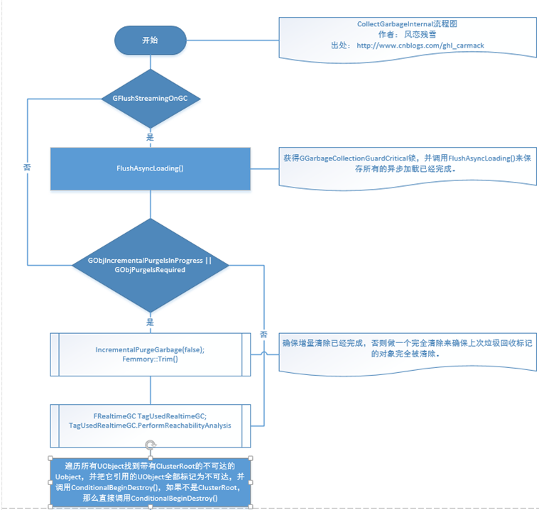
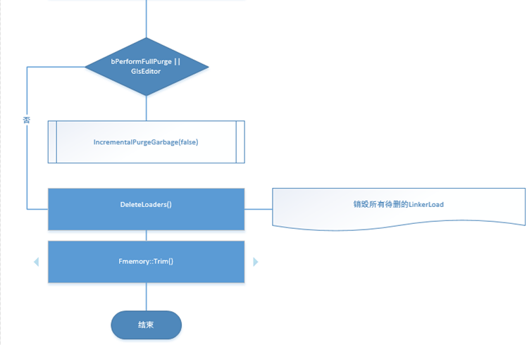
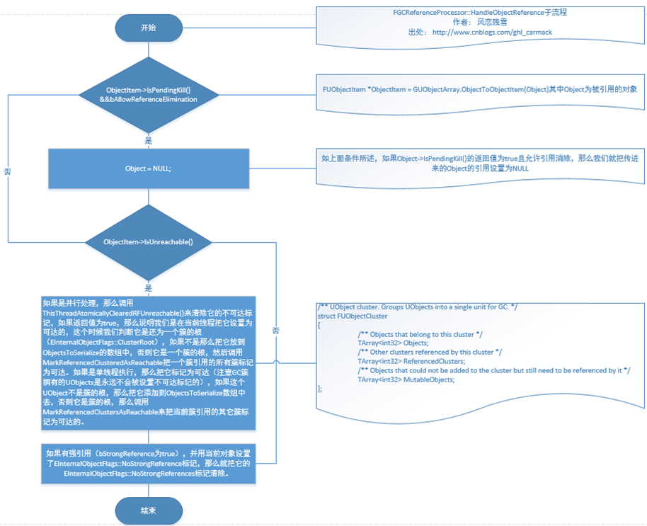
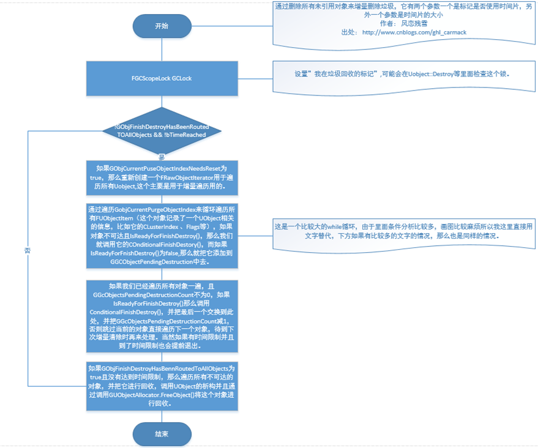

# Garbage Collection

## 简介

垃圾回收（Garbage Collection, GC）是一种自动的内存管理机制，当动态内存不再需要的时候，系统会自动将其释放。底层语言例如C/C++没有提供原生支持，其他如C#则提供了相应的机制。

## UE的GC

当一个继承自UObject的对象被创建的时候，GC系统会将其注册。每隔大约30-60秒，GC系统会查找没有被使用的对象，然后将其销毁。GC会从一些始终存在的Root对象出发，使用反射系统查找对象的property，然后循环找到所有引用的对象。如果对象不能以这种方式找到，则视为不再被使用。之后会将这些对象销毁并释放内存。

## 如何使用

函数内的UObject指针无需担心该问题，与C++类似，其离开作用域后便会自行处理。  
如果UObject的生命周期超过1帧，那么就需要使用成员变量来将其储存起来（指针或是TArray/TMap均可），该成员必须添加UPROPERTY()以供系统识别（只对继承至UObject的类有效）。未添加UPROPERTY()的成员不会被视为引用，可能会被GC提前清理掉。

也可以手动添加引用(`UObject::AddReferencedObjects`, `UObject::AddToRoot`)，但大部分情况不是必要的，需谨慎思考何时去掉该引用。

使用`MarkPendingKill`或者`MarkAsGarbage`可以强制将对象标记为不需要。

可以通过`IsPendingKill`/`IsValid`等函数来查询某对象是否可用。

如果需要管理非UObject的类，可以考虑使用UE提供的智能指针库（`TUniquePtr`, `TSharedPtr`, `TWeakPtr`）。

可以使用`ForceGarbageCollection`或`CollectGarbage`来立即执行GC。

## 具体实现

### CollectGarbageInternal()




### PerformReachabilityAnalysis()

这里首先调用`MarkObjectsAsUnreachable`将所有不带KeepFlags标记和`EinternalObjectFlags::GarbageCollectionKeepFlags`标记的对象全部标记为不可达，并把它们添加到ObjectsToSerialize中去。

```C++
	/** 
	 * Marks all objects that don't have KeepFlags and EInternalObjectFlags::GarbageCollectionKeepFlags as unreachable
	 * This function is a template to speed up the case where we don't need to assemble the token stream (saves about 6ms on PS4)
	 */
	template <bool bParallel, bool bWithClusters>
	void MarkObjectsAsUnreachable(TArray<UObject*>& ObjectsToSerialize, const EObjectFlags KeepFlags)
```

接着会调用`PerformReachabilityAnalysisOnObjectsInternal`执行Reachability检查。

```C++
	template <EFastReferenceCollectorOptions CollectorOptions>
	void PerformReachabilityAnalysisOnObjectsInternal(FGCArrayStruct* ArrayStruct)
	{
		FGCReferenceProcessor<CollectorOptions> ReferenceProcessor;
		// NOTE: we want to run with automatic token stream generation off as it should be already generated at this point,
		// BUT we want to be ignoring Noop tokens as they're only pointing either at null references or at objects that never get GC'd (native classes)
		TFastReferenceCollector<
			FGCReferenceProcessor<CollectorOptions>,
			FGCCollector<CollectorOptions>,
			FGCArrayPool,
			CollectorOptions
			>  ReferenceCollector(ReferenceProcessor, FGCArrayPool::Get());
		ReferenceCollector.CollectReferences(*ArrayStruct);
	}
```

`CollectReferences`最终会调用`ProcessObjectArray`来处理对象。

#### ProcessObjectArray

该函数会遍历传进来的Objects，根据其UClass调用`AssembleReferenceTokenStream`来拿到TokenStream，其包含所有引用信息，然后依次获取`FGCReferenceInfo`，根据其类型来做相应的操作。

#### AssembleReferenceTokenStream

```C++
void UClass::AssembleReferenceTokenStream(bool bForce)
{
		//......

		// Iterate over properties defined in this class
		for( TFieldIterator<FProperty> It(this,EFieldIteratorFlags::ExcludeSuper); It; ++It)
		{
			FProperty* Property = *It;
			Property->EmitReferenceInfo(*this, 0, EncounteredStructProps);
		}

		if (UClass* SuperClass = GetSuperClass())
		{
			// We also need to lock the super class stream in case something (like PostLoad) wants to reconstruct it on GameThread
			FScopeLockIfNotNative SuperClassReferenceTokenStreamLock(SuperClass->ReferenceTokenStreamCritical, !(SuperClass->ClassFlags & CLASS_Native));
			
			// Make sure super class has valid token stream.
			SuperClass->AssembleReferenceTokenStream();
			if (!SuperClass->ReferenceTokenStream.IsEmpty())
			{
				// Prepend super's stream. This automatically handles removing the EOS token.
				ReferenceTokenStream.PrependStream(SuperClass->ReferenceTokenStream);
			}
		}
		else
		{
			UObjectBase::EmitBaseReferences(this);
		}

		//......

		// Emit end of stream token.
		static const FName EOSDebugName("EndOfStreamToken");
		EmitObjectReference(0, EOSDebugName, GCRT_EndOfStream);

		// Shrink reference token stream to proper size.
		ReferenceTokenStream.Shrink();

		check(!HasAnyClassFlags(CLASS_TokenStreamAssembled)); // recursion here is probably bad
		ClassFlags |= CLASS_TokenStreamAssembled;
}
```

这里会遍历所有FProperty，调用`EmitReferenceInfo`，这是一个虚函数，不同的FProperty会有对应实现。。接着会调用父类的`AssembleReferenceTokenStream`。最后加上GCRT_EndOfStream到记号流里面去，并设置CLASS_TokenStreamAssembled标记。

#### FGCReferenceProcessor::HandleObjectReference

拿到TokenStream后，会调用到`FGCReferenceProcessor::HandleObjectReference`里。这里会检查所有引用到的UObject。若UObject已经被标记为IsPendingKill，则这里会将引用置为空。若否则清掉EInternalObjectFlags::Unreachable标记。



自此标记阶段完成，接下来是清扫阶段。

### IncrementalPurgeGarbage

这是一个增量清除的函数，可以设置每次清除的时间限制。



首先`UnhashUnreachableObjects`会对`GUnreachableObjects`里的对象逐个调用`ConditionalBeginDestroy`。

接着在`IncrementalDestroyGarbage`里同样会遍历对象，对`IsReadyForFinishDestroy`的调用`ConditionalFinishDestroy`，其余的加入`GGCObjectsPendingDestruction`里。如果还有时间，则对`GGCObjectsPendingDestruction`进行同样的处理。

最后会使用`FAsyncPurge`来调用析构函数和释放内存(``GUObjectAllocator.FreeUObject(Object);``)，其也支持多线程工作。

至此整个GC的流程就完成了。
