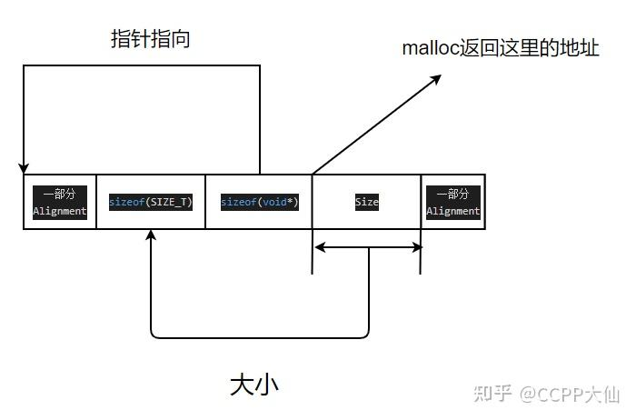
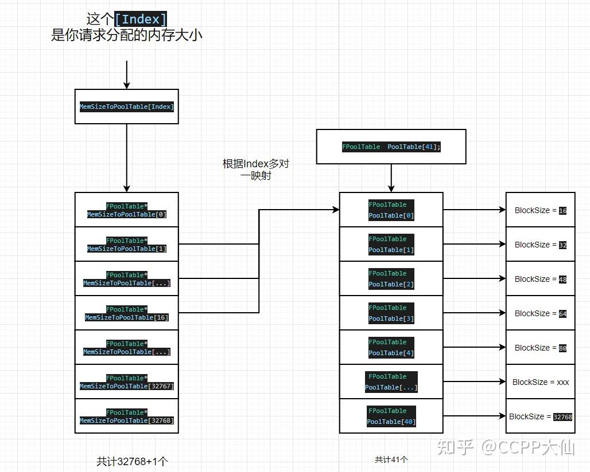
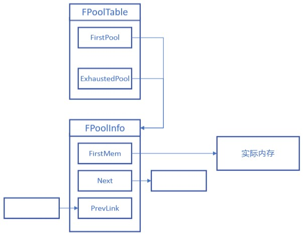
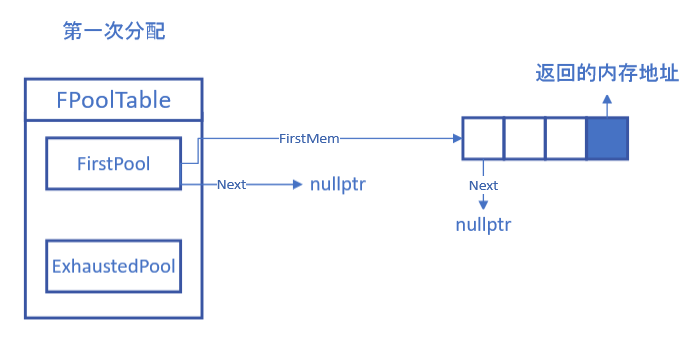
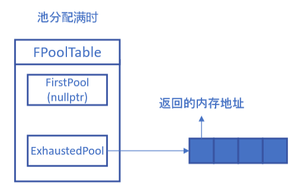
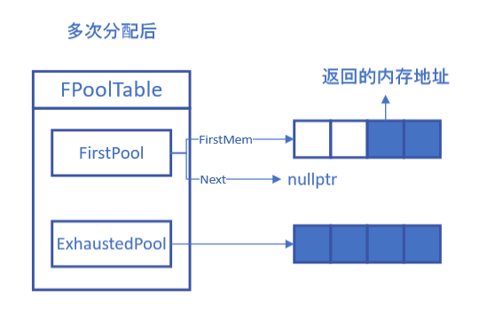
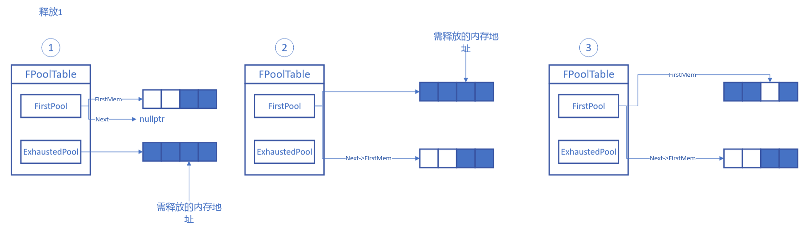
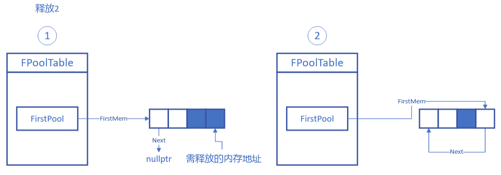

# 内存分配

UE支持多种内存分配器，其均继承自`FMalloc`。

```C++
	/** Which allocator is being used */
	enum EMemoryAllocatorToUse
	{
		Ansi, // Default C allocator
		Stomp, // Allocator to check for memory stomping
		TBB, // Thread Building Blocks malloc
		Jemalloc, // Linux/FreeBSD malloc
		Binned, // Older binned malloc
		Binned2, // Newer binned malloc
		Binned3, // Newer VM-based binned malloc, 64 bit only
		Platform, // Custom platform specific allocator
		Mimalloc, // mimalloc
	};
```

不同平有自己对应的内存管理类，它们继承自`FGenericPlatformMemory`，其`BaseAllocator`函数决定了使用哪种分配器。  

这里主要关注默认C分配器`FMallocAnsi`和UE自己的分配器`FMallocBinned`。

## FMallocAnsi

这是最基础的分配器，其直接从系统分配和释放内存

```C++
void* AnsiMalloc(SIZE_T Size, uint32 Alignment)
{
    // ......
	void* Ptr = malloc(Size + Alignment + sizeof(void*) + sizeof(SIZE_T));
	void* Result = nullptr;
	if (Ptr)
	{
		Result = Align((uint8*)Ptr + sizeof(void*) + sizeof(SIZE_T), Alignment);
		 *((void**)((uint8*)Result - sizeof(void*))) = Ptr;
		*((SIZE_T*)((uint8*)Result - sizeof(void*) - sizeof(SIZE_T))) = Size;
	}

	return Result;
}
```

其在分配时添加对齐，记录了分配的大小，也需要系统实际分配出的地址，于是总size为`(Size + Alignment + sizeof(void*) + sizeof(SIZE_T))`。

```C++
/**
 * Aligns a value to the nearest higher multiple of 'Alignment', which must be a power of two.
 *
 * @param  Val        The value to align.
 * @param  Alignment  The alignment value, must be a power of two.
 *
 * @return The value aligned up to the specified alignment.
 */
template <typename T>
FORCEINLINE constexpr T Align(T Val, uint64 Alignment)
{
	static_assert(TIsIntegral<T>::Value || TIsPointer<T>::Value, "Align expects an integer or pointer type");

	return (T)(((uint64)Val + Alignment - 1) & ~(Alignment - 1));
}
```

对齐则是将指针向高位移到相应的位置。以对齐到16为例，对16-1(0xF，二进制1111)取反再位与，也就是清除后四位。这会向低位移动到对齐的位置。为了避免移动出界，提前加上了16-1，最终就能得到最近的高位对齐的位置。

分配后的内存结构如下：

释放时则是直接释放系统给的地址。

```C++
void AnsiFree(void* Ptr)
{
    // ......
	if (Ptr)
	{
		free(*((void**)((uint8*)Ptr - sizeof(void*))));
	}
}
```

## FMallocBinned

这是UE自己实现的池分配器。池分配器的目的是维持最低限度的动态分配，同时避免内存碎片。其适用于经常分配大量同尺寸小块内存的情况。

其主要结构如下：

```C++
	// Counts.
	enum { POOL_COUNT = 41 };

	/** Maximum allocation for the pooled allocator */
	enum { EXTENDED_PAGE_POOL_ALLOCATION_COUNT = 2 };
	enum { MAX_POOLED_ALLOCATION_SIZE   = 32768+1 };

	// Forward declares.
	struct FFreeMem;
	struct FPoolInfo;
	struct FPoolTable;
	struct PoolHashBucket;

	// ......

	// Variables.
	FPoolTable  PoolTable[POOL_COUNT];
	FPoolTable	OsTable;
	FPoolTable	PagePoolTable[EXTENDED_PAGE_POOL_ALLOCATION_COUNT];
	FPoolTable* MemSizeToPoolTable[MAX_POOLED_ALLOCATION_SIZE+EXTENDED_PAGE_POOL_ALLOCATION_COUNT];
	
	PoolHashBucket* HashBuckets;
	PoolHashBucket* HashBucketFreeList;
	
	uint32		PageSize;
```

其包含了不同的`FPoolTable`用于管理不同大小的内存块，也有一个根据大小查找相应`FPoolTable`的数组。

### FPoolTable

```C++
	/** Pool table. */
	struct FPoolTable
	{
		FPoolInfo*			FirstPool;
		FPoolInfo*			ExhaustedPool;
		uint32				BlockSize;
		// ......
	}
```

其记录了当前`BlockSize`使用的内存池，包含当前可用的池`FirstPool`和已经全部用完的池`ExhaustedPool`。



### FPoolInfo

```C++
// Memory pool info. 32 bytes.
struct FMallocBinned::FPoolInfo
{
	/** Number of allocated elements in this pool, when counts down to zero can free the entire pool. */
	uint16			Taken;		// 2
	/** Index of pool. Index into MemSizeToPoolTable[]. Valid when < MAX_POOLED_ALLOCATION_SIZE, MAX_POOLED_ALLOCATION_SIZE is OsTable.
		When AllocSize is 0, this is the number of pages to step back to find the base address of an allocation. See FindPoolInfoInternal()
	*/
	uint16			TableIndex; // 4		
	/** Number of bytes allocated */
	uint32			AllocSize;	// 8
	/** Pointer to first free memory in this pool or the OS Allocation Size in bytes if this allocation is not binned*/
	FFreeMem*		FirstMem;   // 12/16
	FPoolInfo*		Next;		// 16/24
	FPoolInfo**		PrevLink;	// 20/32
#if PLATFORM_32BITS
	/** Explicit padding for 32 bit builds */
	uint8 Padding[12]; // 32
#endif
	// ......
}
```

这是一个管理单个池的链表节点，`FirstMem`为该内存池的首地址，`Taken`是池内已经分配的内存块数量。

这里也使用了哈希表来快速查找。



### FMallocBinned构造函数

使用不同大小的块来初始化`PoolTable`

```C++
	// Block sizes are based around getting the maximum amount of allocations per pool, with as little alignment waste as possible.
	// Block sizes should be close to even divisors of the POOL_SIZE, and well distributed. They must be 16-byte aligned as well.
	static const uint32 BlockSizes[POOL_COUNT] =
	{
		16,		32,		48,		64,		80,		96,		112,	128,
		160,	192,	224,	256,	288,	320,	384,	448,
		512,	576,	640,	704,	768,	896,	1024,	1168,
		1360,	1632,	2048,	2336,	2720,	3264,	4096,	4672,
		5456,	6544,	8192,	9360,	10912,	13104,	16384,	21840,	32768
	};

	for( uint32 i = 0; i < POOL_COUNT; i++ )
	{
		PoolTable[i].FirstPool = nullptr;
		PoolTable[i].ExhaustedPool = nullptr;
		PoolTable[i].BlockSize = BlockSizes[i];
		check(IsAligned(BlockSizes[i], Private::DEFAULT_BINNED_ALLOCATOR_ALIGNMENT));
#if STATS
		PoolTable[i].MinRequest = PoolTable[i].BlockSize;
#endif
	}
```

然后在`MemSizeToPoolTable`中记录每个请求的内存大小应位于哪个`PoolTable`

```C++
	for( uint32 i=0; i<MAX_POOLED_ALLOCATION_SIZE; i++ )
	{
		uint32 Index = 0;
		while( PoolTable[Index].BlockSize < i )
		{
			++Index;
		}
		checkSlow(Index < POOL_COUNT);
		MemSizeToPoolTable[i] = &PoolTable[Index];
	}
```

接下来以Windows平台为例。对于`PageSize`为64k的平台，还提供了两个额外的`PagePoolTable`。

```C++
	/** The following options are not valid for page sizes less than 64k. They are here to reduce waste*/
	PagePoolTable[0].FirstPool = nullptr;
	PagePoolTable[0].ExhaustedPool = nullptr;
	PagePoolTable[0].BlockSize = PageSize == Private::PAGE_SIZE_LIMIT ? BinnedSizeLimit+(BinnedSizeLimit/2) : 0;

	PagePoolTable[1].FirstPool = nullptr;
	PagePoolTable[1].ExhaustedPool = nullptr;
	PagePoolTable[1].BlockSize = PageSize == Private::PAGE_SIZE_LIMIT ? PageSize+BinnedSizeLimit : 0;

	// ......

	MemSizeToPoolTable[BinnedSizeLimit] = PagePoolTable[0];
	MemSizeToPoolTable[BinnedSizeLimit+1] = &PagePoolTable[1];
```

`BinnedSizeLimit`为`Private::PAGE_SIZE_LIMIT/2`，这里也就是32k，两个池子大小分别是48k和96k。

## FMallocBinned::Malloc

分配内存时，根据请求的大小进行不同的处理。对小于32k的请求，使用普通的PoolTable管理。

```C++
		if( (Size < BinnedSizeLimit) && (Alignment == Private::DEFAULT_BINNED_ALLOCATOR_ALIGNMENT) )
		{
			// Allocate from pool.
			FPoolTable* Table = MemSizeToPoolTable[Size];
#ifdef USE_FINE_GRAIN_LOCKS
			FScopeLock TableLock(&Table->CriticalSection);
#endif
			Private::TrackStats(Table, (uint32)Size);

			FPoolInfo* Pool = Table->FirstPool;
			if( !Pool )
			{
				Pool = Private::AllocatePoolMemory(*this, Table, Private::BINNED_ALLOC_POOL_SIZE/*PageSize*/, Size);
			}

			Free = Private::AllocateBlockFromPool(*this, Table, Pool, Alignment);
		}
```

对于32k-48k的请求，使用第一个拓展池，64k-96k使用第二个拓展池。分配逻辑基本相似。

```C++
		else if ( ((Size >= BinnedSizeLimit && Size <= PagePoolTable[0].BlockSize) ||
				   (Size > PageSize && Size <= PagePoolTable[1].BlockSize)) && (Alignment <= PAGE_ALIGNMENT))
		{
			// Bucket in a pool of 3*PageSize or 6*PageSize
			uint32 BinType = Size < PageSize ? 0 : 1;
			uint32 PageCount = 3*BinType + 3;
			FPoolTable* Table = &PagePoolTable[BinType];
#ifdef USE_FINE_GRAIN_LOCKS
			FScopeLock TableLock(&Table->CriticalSection);
#endif
			Private::TrackStats(Table, (uint32)Size);

			FPoolInfo* Pool = Table->FirstPool;
			if( !Pool )
			{
				Pool = Private::AllocatePoolMemory(*this, Table, PageCount*PageSize, BinnedSizeLimit+BinType);
			}

			Free = Private::AllocateBlockFromPool(*this, Table, Pool, Alignment);
		}
```

其他大小则直接是用系统分配内存。

```C++
		else
		{
			// Use OS for large allocations.
			UPTRINT AlignedSize = Align(Size, PageSize);
			SIZE_T ActualPoolSize; //TODO: use this to reduce waste?
			Free = (FFreeMem*)Private::OSAlloc(*this, AlignedSize, ActualPoolSize);
			if (!Free)
			{
				Private::OutOfMemory(AlignedSize);
			}

			void* AlignedFree = Align(Free, Alignment);

			// Create indirect.
			FPoolInfo* Pool;
			{
#ifdef USE_FINE_GRAIN_LOCKS
				FScopeLock PoolInfoLock(&AccessGuard);
#endif
				Pool = Private::GetPoolInfo(*this, (UPTRINT)Free);

				if ((UPTRINT)Free != ((UPTRINT)AlignedFree & ~((UPTRINT)PageSize - 1)))
				{
					// Mark the FPoolInfo for AlignedFree to jump back to the FPoolInfo for ptr.
					for (UPTRINT i = (UPTRINT)PageSize, Offset = 0; i < AlignedSize; i += PageSize, ++Offset)
					{
						FPoolInfo* TrailingPool = Private::GetPoolInfo(*this, ((UPTRINT)Free) + i);
						check(TrailingPool);
						//Set trailing pools to point back to first pool
						TrailingPool->SetAllocationSizes(0, 0, Offset, BinnedOSTableIndex);
					}
				}
			}
			Free = (FFreeMem*)AlignedFree;
			Pool->SetAllocationSizes(Size, AlignedSize, BinnedOSTableIndex, BinnedOSTableIndex);
		}
```

### AllocatePoolMemory

当通过请求的大小找到对应的FPoolTable后，若此时没有可用的内存池，则调用该函数创建一个。

```C++
		// Must create a new pool.
		uint32 Blocks   = PoolSize / Table->BlockSize;
		uint32 Bytes    = Blocks * Table->BlockSize;
		UPTRINT OsBytes = Align(Bytes, PageSize);

		// ......

		if (Free == nullptr)
		{
			Free = (FFreeMem*)OSAlloc(Allocator, OsBytes, ActualPoolSize);
		}
```

首先根据`PageSize`从系统分配一块内存，然后按照`BlockSize`划分为不同的块。

```C++
		// Create pool in the indirect table.
		FPoolInfo* Pool;
		{
			Pool = GetPoolInfo(Allocator, (UPTRINT)Free);
			// ......
		}

		// Init pool.
		Pool->Link( Table->FirstPool );
		Pool->SetAllocationSizes(Bytes, OsBytes, TableIndex, Allocator.BinnedOSTableIndex);
		Pool->Taken		 = 0;
		Pool->FirstMem   = Free;

		// Create first free item.
		Free->NumFreeBlocks = Blocks;
		Free->Next          = nullptr;
```

然后根据内存地址获取`FPoolInfo`。接着将其加到`PoolTable`的可用池里并记录已使用的数量，并将申请到的内存记录到`FirstMem`供分配时使用。`FFreeMem`里也记录了可用的Blocks数量。

#### GetPoolInfo

这里使用哈希表，通过内存地址获取相应的FPoolInfo

```C++
	static FORCEINLINE FPoolInfo* GetPoolInfo(FMallocBinned& Allocator, UPTRINT Ptr)
	{
		if (!Allocator.HashBuckets)
		{
			Allocator.HashBuckets = CreateHashBuckets(Allocator);
		}
		checkSlow(Allocator.HashBuckets);

		UPTRINT Key       = Ptr >> Allocator.HashKeyShift;
		UPTRINT Hash      = Key & (Allocator.MaxHashBuckets - 1);
		UPTRINT PoolIndex = ((UPTRINT)Ptr >> Allocator.PoolBitShift) & Allocator.PoolMask;

		PoolHashBucket* Collision = &Allocator.HashBuckets[Hash];
		do
		{
			if (Collision->Key == Key || !Collision->FirstPool)
			{
				if (!Collision->FirstPool)
				{
					Collision->Key = Key;
					InitializeHashBucket(Allocator, Collision);
					CA_ASSUME(Collision->FirstPool);
				}
				return &Collision->FirstPool[PoolIndex];
			}

			Collision = Collision->Next;
		} while (Collision != &Allocator.HashBuckets[Hash]);

		//Create a new hash bucket entry
		PoolHashBucket* NewBucket = CreateHashBucket(Allocator);
		NewBucket->Key = Key;
		Allocator.HashBuckets[Hash].Link(NewBucket);

		return &NewBucket->FirstPool[PoolIndex];
	}
```

如果还没有哈希表或者当前桶无法解决碰撞问题，则会调用`CreateHashBuckets`来创建一块新桶。如果找到空闲的位置，则会调用`InitializeHashBucket`来创建`FPoolInfo`。或者找到已经存在的FPoolInfo，则会直接返回。

### AllocateBlockFromPool

获取到当前可用池后，会调用该函数，从池里取出一块内存。

```C++
	static FORCEINLINE FFreeMem* AllocateBlockFromPool(FMallocBinned& Allocator, FPoolTable* Table, FPoolInfo* Pool, uint32 Alignment)
	{
		// Pick first available block and unlink it.
		Pool->Taken++;
		FFreeMem* Free = (FFreeMem*)((uint8*)Pool->FirstMem + --Pool->FirstMem->NumFreeBlocks * Table->BlockSize);
		if( !Pool->FirstMem->NumFreeBlocks )
		{
			Pool->FirstMem = Pool->FirstMem->Next;
			if( !Pool->FirstMem )
			{
				// Move to exhausted list.
				Pool->Unlink();
				Pool->Link( Table->ExhaustedPool );
			}
		}
		return Align(Free, Alignment);
	}
```

这里从后往前取出一块内存返回，并且会将`Pool->Taken`加1，`Pool->FirstMem->NumFreeBlocks`减1。当NumFreeBlocks为0时，将FirstMem更新为Next。此值在释放时更新，指向下一个可用块。若Next为空，则说明整个Pool都被使用了，将其移动到`ExhaustedPool`。

## FMallocBinned::Free

这里最终会调用到`FreeInternal`：

```C++
		UPTRINT BasePtr;
		FPoolInfo* Pool = FindPoolInfo(Allocator, (UPTRINT)Ptr, BasePtr);

		if (Pool->TableIndex < Allocator.BinnedOSTableIndex)
		{
			// ......
		}
		else
		{
			// Free an OS allocation.
			checkSlow(!((UPTRINT)Ptr & (Allocator.PageSize - 1)));
			SIZE_T OsBytes = Pool->GetOsBytes(Allocator.PageSize, Allocator.BinnedOSTableIndex);

			OSFree(Allocator, (void*)BasePtr, OsBytes);
		}
```

首先调用`FindPoolInfo`通过哈希表找到内存地址对应的FPoolInfo。然后通过index判断是否为内存池管理，若否则说明是系统直接分配的，调用系统释放即可。若是，则执行以下流程:

```C++
			FPoolTable* Table = Allocator.MemSizeToPoolTable[Pool->TableIndex];
#ifdef USE_FINE_GRAIN_LOCKS
			FScopeLock TableLock(&Table->CriticalSection);
#endif
#if STATS
			Table->ActiveRequests--;
#endif
			// If this pool was exhausted, move to available list.
			if( !Pool->FirstMem )
			{
				Pool->Unlink();
				Pool->Link( Table->FirstPool );
			}
```

首先检查是否为exhausted（既全部block都分配出去的），如果是，则将其移回可用池中，供下次分配时重复利用。

```C++
			void* BaseAddress = (void*)BasePtr;
			uint32 BlockSize = Table->BlockSize;
			PTRINT OffsetFromBase = (PTRINT)Ptr - (PTRINT)BaseAddress;
			check(OffsetFromBase >= 0);
			uint32 AlignOffset = OffsetFromBase % BlockSize;

			// Patch pointer to include previously applied alignment.
			Ptr = (void*)((PTRINT)Ptr - (PTRINT)AlignOffset);

			// Free a pooled allocation.
			FFreeMem* Free		= (FFreeMem*)Ptr;
			Free->NumFreeBlocks	= 1;
			Free->Next			= Pool->FirstMem;
			Pool->FirstMem		= Free;
```

然后将此块视为可用，将原本的池里的`FirstMem`指向自己的`Next`，再将自己作为`FirstMem`，这样下次从这个池子分配时就会使用这块内存。

```C++
			// Free this pool.
			checkSlow(Pool->Taken >= 1);
			if( --Pool->Taken == 0 )
			{
				// Free the OS memory.
				SIZE_T OsBytes = Pool->GetOsBytes(Allocator.PageSize, Allocator.BinnedOSTableIndex);

				Pool->Unlink();
				Pool->SetAllocationSizes(0, 0, 0, Allocator.BinnedOSTableIndex);
				OSFree(Allocator, (void*)BasePtr, OsBytes);
			}
```

最后，若检查到整个池子都被释放了，则可以将整块内存交给系统释放。

## 示例






