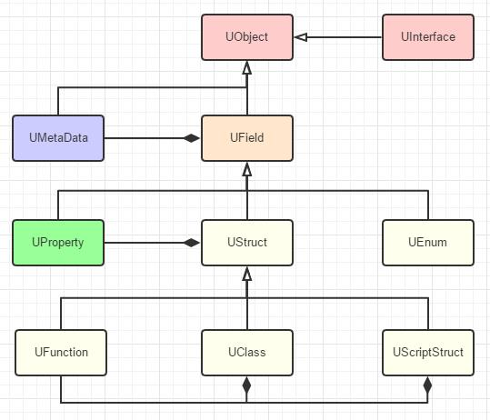

# 反射系统

## UE的反射系统

反射指程序可以访问、检测和修改它本身状态或行为的一种能力（如获取实例的类型，成员，函数等）。在UE中，它支撑了诸如编辑器中的细节面板、序列化、垃圾回收、网络复制、以及蓝图与C++交互等功能。  
UE使用Unreal Header Tool(UHT)，在编译工程的时候利用特定的信息（UENUM()、UCLASS()、USTRUCT()、UFUNCTION()、以及UPROPERTY()等）生成特定的代码。  
反射相关的类如图：

(引擎现在使用FProperty来代替图中的UProprety)  
每一个继承UObject且支持反射系统类型都有一个相对应的UClass,或者它的子类（比如蓝图对应的课表UBlueprintGeneratedClass类，它继承自UClass）。UMetaData是元数据，它存储了一些编辑器需要的额外信息，比如它的分类（Category ）、提示（Tooltip）等，最终打包的时候是不会用到这些信息的。至于我们反射系统里需要访问的float、int32等变量，则都是由继承自UProperty的子类来表示的。函数使用UFunction，C++的struct则对应UScriptStruct，而UStruct是他们的公共基类。

## 生成代码

### 具体例子

UHT会根据宏来生成对应的支持反射的代码，通常是XXX.generated.cpp和XXX.generated.h文件。  
结合示例来看

```C++
UCLASS(Blueprintable)
class AClassName : public AActor
{
	GENERATED_BODY()
	
public:	
	UPROPERTY(EditAnywhere, Category = "CategoryName")
	float PropertyName;

	UFUNCTION(BlueprintCallable, Category = "CategoryName")
	float CallableFuncName();

	UFUNCTION(BlueprintImplementableEvent, Category = "CategoryName")
	void ImplementableFuncName();

	UFUNCTION(BlueprintNativeEvent, Category = "CategoryName")
	void NativeFuncName(int Var);
};
};
```

### ClassName.generated.h

首先注意创建类时自动添加的GENERATED_BODY()

```C++
#define GENERATED_BODY(...) BODY_MACRO_COMBINE(CURRENT_FILE_ID,_,__LINE__,_GENERATED_BODY);
```

在生成的.h中，从后往前看：

```C++
#define GameName_Source_GameName_Private_ClassName_h_12_GENERATED_BODY \
PRAGMA_DISABLE_DEPRECATION_WARNINGS \
public: \
	GameName_Source_GameName_Private_ClassName_h_12_PRIVATE_PROPERTY_OFFSET \
	GameName_Source_GameName_Private_ClassName_h_12_SPARSE_DATA \
	GameName_Source_GameName_Private_ClassName_h_12_RPC_WRAPPERS_NO_PURE_DECLS \
	GameName_Source_GameName_Private_ClassName_h_12_CALLBACK_WRAPPERS \
	GameName_Source_GameName_Private_ClassName_h_12_INCLASS_NO_PURE_DECLS \
	GameName_Source_GameName_Private_ClassName_h_12_ENHANCED_CONSTRUCTORS \
private: \
PRAGMA_ENABLE_DEPRECATION_WARNINGS


template<> GAMENAME_API UClass* StaticClass<class AClassName>();

#undef CURRENT_FILE_ID
#define CURRENT_FILE_ID GameName_Source_GameName_Private_ClassName_h
```

这就是GENERATED_BODY为我们添加的内容

```C++
#define GameName_Source_GameName_Private_ClassName_h_12_ENHANCED_CONSTRUCTORS \
	/** Standard constructor, called after all reflected properties have been initialized */ \
	NO_API AClassName(const FObjectInitializer& ObjectInitializer = FObjectInitializer::Get()) : Super(ObjectInitializer) { }; \
private: \
	/** Private move- and copy-constructors, should never be used */ \
	NO_API AClassName(AClassName&&); \
	NO_API AClassName(const AClassName&); \
public: \
	DECLARE_VTABLE_PTR_HELPER_CTOR(NO_API, AClassName); \
	DEFINE_VTABLE_PTR_HELPER_CTOR_CALLER(AClassName); \
	DEFINE_DEFAULT_OBJECT_INITIALIZER_CONSTRUCTOR_CALL(AClassName)
```

这里定义了构造函数。拷贝构造函数被设为了Private，防止被调用。DEFINE_DEFAULT_OBJECT_INITIALIZER_CONSTRUCTOR_CALL也包装了一个默认构造函数。

```C++
#define GameName_Source_GameName_Private_ClassName_h_12_INCLASS_NO_PURE_DECLS \
private: \
	static void StaticRegisterNativesAClassName(); \
	friend struct Z_Construct_UClass_AClassName_Statics; \
public: \
	DECLARE_CLASS(AClassName, AActor, COMPILED_IN_FLAGS(0 | CLASS_Config), CASTCLASS_None, TEXT("/Script/GameName"), NO_API) \
	DECLARE_SERIALIZER(AClassName)
```

- StaticRegisterNativesAClassName 用来注册C++原生函数暴露给虚拟机使用，详见下面cpp部分。
- friend struct Z_Construct_UClass_AClassName_Statics 声明友元，用与构建此类对应的UClass。
- DECLARE_SERIALIZER 定义序列化代码。

DECLARE_CLASS 其包含了许多常用声明，如Super，StaticClass()等，具体如下：

```C++
#define DECLARE_CLASS( TClass, TSuperClass, TStaticFlags, TStaticCastFlags, TPackage, TRequiredAPI  ) \
private: \
    TClass& operator=(TClass&&);   \
    TClass& operator=(const TClass&);   \
	TRequiredAPI static UClass* GetPrivateStaticClass(); \
public: \
	/** Bitwise union of #EClassFlags pertaining to this class.*/ \
	enum {StaticClassFlags=TStaticFlags}; \
	/** Typedef for the base class ({{ typedef-type }}) */ \
	typedef TSuperClass Super;\
	/** Typedef for {{ typedef-type }}. */ \
	typedef TClass ThisClass;\
	/** Returns a UClass object representing this class at runtime */ \
	inline static UClass* StaticClass() \
	{ \
		return GetPrivateStaticClass(); \
	} \
	/** Returns the package this class belongs in */ \
	inline static const TCHAR* StaticPackage() \
	{ \
		return TPackage; \
	} \
	/** Returns the static cast flags for this class */ \
	inline static EClassCastFlags StaticClassCastFlags() \
	{ \
		return TStaticCastFlags; \
	} \
	/** For internal use only; use StaticConstructObject() to create new objects. */ \
	inline void* operator new(const size_t InSize, EInternal InInternalOnly, UObject* InOuter = (UObject*)GetTransientPackage(), FName InName = NAME_None, EObjectFlags InSetFlags = RF_NoFlags) \
	{ \
		return StaticAllocateObject(StaticClass(), InOuter, InName, InSetFlags); \
	} \
	/** For internal use only; use StaticConstructObject() to create new objects. */ \
	inline void* operator new( const size_t InSize, EInternal* InMem ) \
	{ \
		return (void*)InMem; \
	}
```

```C++
#define GameName_Source_GameName_Private_ClassName_h_12_RPC_WRAPPERS_NO_PURE_DECLS \
	virtual void NativeFuncName_Implementation(int32 Var); \
 \
	DECLARE_FUNCTION(execNativeFuncName); \
	DECLARE_FUNCTION(execCallableFuncName);


#define GameName_Source_GameName_Private_ClassName_h_12_EVENT_PARMS \
	struct ClassName_eventNativeFuncName_Parms \
	{ \
		int32 Var; \
	};
```

这里声明了蓝图调用C++函数需要用到的参数，以及BlueprintNativeEvent添加_Implementation版的函数。

### ClassName.gen.cpp

```C++
	DEFINE_FUNCTION(AClassName::execNativeFuncName)
	{
		P_GET_PROPERTY(FIntProperty,Z_Param_Var);
		P_FINISH;
		P_NATIVE_BEGIN;
		P_THIS->NativeFuncName_Implementation(Z_Param_Var);
		P_NATIVE_END;
	}
	DEFINE_FUNCTION(AClassName::execCallableFuncName)
	{
		P_FINISH;
		P_NATIVE_BEGIN;
		*(float*)Z_Param__Result=P_THIS->CallableFuncName();
		P_NATIVE_END;
	}
```

对于蓝图调C++的函数，UHT会生成加上exec前缀的版本。对于BlueprintNativeEvent，这里添加了_Implementation版本，因此需要在原cpp里实现。

```C++
	static FName NAME_AClassName_ImplementableFuncName = FName(TEXT("ImplementableFuncName"));
	void AClassName::ImplementableFuncName()
	{
		ProcessEvent(FindFunctionChecked(NAME_AClassName_ImplementableFuncName),NULL);
	}
	static FName NAME_AClassName_NativeFuncName = FName(TEXT("NativeFuncName"));
	void AClassName::NativeFuncName(int32 Var)
	{
		ClassName_eventNativeFuncName_Parms Parms;
		Parms.Var=Var;
		ProcessEvent(FindFunctionChecked(NAME_AClassName_NativeFuncName),&Parms);
	}
```

C++调蓝图的函数，则会生成调用ProcessEvent的版本，这也是为什么BlueprintImplementableEvent的函数不需要在原本的cpp里实现。

```C++
	void AClassName::StaticRegisterNativesAClassName()
	{
		UClass* Class = AClassName::StaticClass();
		static const FNameNativePtrPair Funcs[] = {
			{ "CallableFuncName", &AClassName::execCallableFuncName },
			{ "NativeFuncName", &AClassName::execNativeFuncName },
		};
		FNativeFunctionRegistrar::RegisterFunctions(Class, Funcs, UE_ARRAY_COUNT(Funcs));
	}
```
StaticRegisterNativesXXX会向XXX::StaticClass()注册原生的C++函数

```C++
	// 省略了构造Z_Construct_UFunction_AClassName_CallableFuncName_Statics的内容
	UFunction* Z_Construct_UFunction_AClassName_CallableFuncName()
	{
		static UFunction* ReturnFunction = nullptr;
		if (!ReturnFunction)
		{
			UE4CodeGen_Private::ConstructUFunction(ReturnFunction, Z_Construct_UFunction_AClassName_CallableFuncName_Statics::FuncParams);
		}
		return ReturnFunction;
	}

	void ConstructUFunction(UFunction*& OutFunction, const FFunctionParams& Params)
	{
		//......
		UFunction* NewFunction;
		//......
		{
			NewFunction = new (EC_InternalUseOnlyConstructor, Outer, UTF8_TO_TCHAR(Params.NameUTF8), Params.ObjectFlags) UFunction(
				FObjectInitializer(),
				Super,
				Params.FunctionFlags,
				Params.StructureSize
			);
		}
		OutFunction = NewFunction;

#if WITH_METADATA
		AddMetaData(NewFunction, Params.MetaDataArray, Params.NumMetaData);
#endif
		NewFunction->RPCId = Params.RPCId;
		NewFunction->RPCResponseId = Params.RPCResponseId;

		ConstructFProperties(NewFunction, Params.PropertyArray, Params.NumProperties);

		NewFunction->Bind();
		NewFunction->StaticLink();
	}
```
这里创建了CallableFuncName这个函数对应的UFunction对象，而#if WITH_METADATA里面则是的元数据，例如Category分类，放在了它GetOutermost（也就是UPackage）的UMetaData里。ImplementableFuncName和NativeFuncName也是类似的。

```C++
// 省略了构造Z_Construct_UClass_AClassName_Statics的内容
	UClass* Z_Construct_UClass_AClassName()
	{
		static UClass* OuterClass = nullptr;
		if (!OuterClass)
		{
			UE4CodeGen_Private::ConstructUClass(OuterClass, Z_Construct_UClass_AClassName_Statics::ClassParams);
		}
		return OuterClass;
	}

	void ConstructUClass(UClass*& OutClass, const FClassParams& Params)
	{
		//......
		/*
		UObject* (*const Z_Construct_UClass_AClassName_Statics::DependentSingletons[])() = {
		(UObject* (*)())Z_Construct_UClass_AActor,
		(UObject* (*)())Z_Construct_UPackage__Script_GameName,
		};
		*/
		for (UObject* (*const *SingletonFunc)() = Params.DependencySingletonFuncArray, *(*const *SingletonFuncEnd)() = SingletonFunc + Params.NumDependencySingletons; SingletonFunc != SingletonFuncEnd; ++SingletonFunc)
		{
			(*SingletonFunc)();
		}
		//......
		/*
		const FClassFunctionLinkInfo Z_Construct_UClass_AClassName_Statics::FuncInfo[] = {
			{ &Z_Construct_UFunction_AClassName_CallableFuncName, "CallableFuncName" }, // 2014839406
			{ &Z_Construct_UFunction_AClassName_ImplementableFuncName, "ImplementableFuncName" }, // 4157491371
			{ &Z_Construct_UFunction_AClassName_NativeFuncName, "NativeFuncName" }, // 3559748846
		};
		*/
		NewClass->CreateLinkAndAddChildFunctionsToMap(Params.FunctionLinkArray, Params.NumFunctions);

		/*
		const UE4CodeGen_Private::FPropertyParamsBase* const Z_Construct_UClass_AClassName_Statics::PropPointers[] = {
			(const UE4CodeGen_Private::FPropertyParamsBase*)&Z_Construct_UClass_AClassName_Statics::NewProp_PropertyName,
		};
		*/
		ConstructFProperties(NewClass, Params.PropertyArray, Params.NumProperties);
		//......
#if WITH_METADATA
		AddMetaData(NewClass, Params.MetaDataArray, Params.NumMetaData);
#endif

		NewClass->StaticLink();
		//......
	}
```

- 这里创建了UClass对象，并注册所有的UFunction和UProperty
- 其基类为AActor，故先调用Z_Construct_UClass_AActor以保证基类的UClass有效
- Z_Construct_UPackage__Script_GameName用于确保UPackage已经创建
- ConstructFProperty里可以看到支持反射的变量类型

```C++
	IMPLEMENT_CLASS(AClassName, 1175455026);
	template<> GAMENAME_API UClass* StaticClass<AClassName>()
	{
		return AClassName::StaticClass();
	}
	static FCompiledInDefer Z_CompiledInDefer_UClass_AClassName(Z_Construct_UClass_AClassName, &AClassName::StaticClass, TEXT("/Script/GameName"), TEXT("AClassName"), false, nullptr, nullptr, nullptr);
	DEFINE_VTABLE_PTR_HELPER_CTOR(AClassName);
```

- IMPLEMENT_CLASS 定义了一个静态全局变量，用于在程序启动的时候注册这个类，包括生成UClass类以及注册C++原生函数等操作。
- Z_CompiledInDefer_UClass_AClassName存放一个静态变量，用于初始化默认的反射属性。（参考ProcessNewlyLoadedUObjects）
- DEFINE_VTABLE_PTR_HELPER_CTOR定义一个参数为FVTableHelper构造函数。
