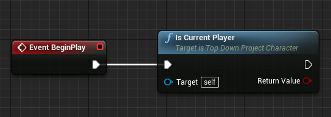
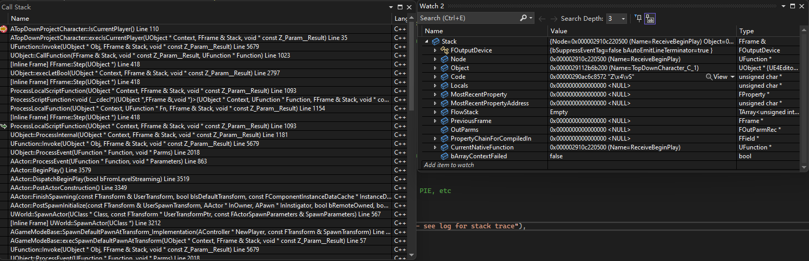
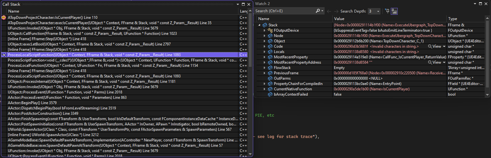

# 蓝图虚拟机

## 虚拟机

编译型语言和解释型语言：编译型语言的源码有编译器翻译为机器码，这些机器码直接在CPU上运行。而解释型语言可以在运行时解析，或是先编译为平台无关的字节码，然后再虚拟机中执行。虚拟机如同一个假想的CPU模拟，字节码就如同机器码。  
虚拟机的好处在于其比较容易移植到几乎所有硬件平台，并可以嵌入到游戏引擎里。其缺点就是执行速度比原生CPU执行机器码要慢得多。

## UE蓝图

### FFrame

FFrame可以简单理解为一个调用栈帧，在调用蓝图UFunction时创建，例如ProcessEvent和ProcessScriptFunction。其成员有：

```C++
	UFunction* Node; //当前执行的节点
	UObject* Object; //执行的对象
	uint8* Code;     //字节码索引
	FProperty* MostRecentProperty; //最近使用的uproperty
	UFunction* CurrentNativeFunction; // Currently executed native function
```

其主要方法为`Step`，取出字节码，然后执行。

```C++
void FFrame::Step(UObject* Context, RESULT_DECL)
{
	int32 B = *Code++;
	(GNatives[B])(Context,*this,RESULT_PARAM);
}
```

### 执行流程



#### C++调蓝图

以BeginPlay为例，C++中调用ReceiveBeginPlay时，会通过UObject::ProcessEvent来执行UFunction。  
ProcessEvent会创建一个FFrame，而ReceiveBeginPlay为本地函数，最终会调用到ProcessLocalScriptFunction，其简化后如下，一步步往前调用蓝图节点，直到遇到EX_Return返回

```C++
while (*Stack.Code != EX_Return)
{
    Stack.Step(Stack.Object, Buffer);
}
```



#### 蓝图调C++

我们声明的`BlueprintCallable`函数会通过UHT生成一个execXXX函数，此函数会真正调用到我们的函数里。  
蓝图里通过ExecuteUbergraph调用，其包含Editor里的EventGraph内的节点（似乎是除Event和native外的所有节点），此时创建一个FFrmae。  
而我们的函数不是虚函数，而且是本地函数，则直接通过UObject::CallFunction->UFunction::Invoke调用到ecec里。

